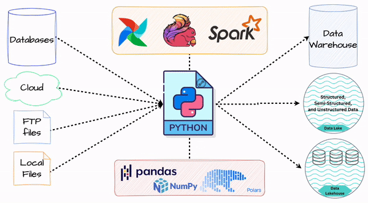
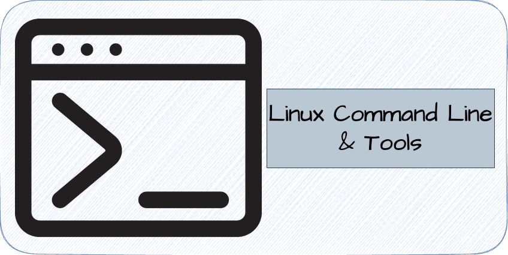
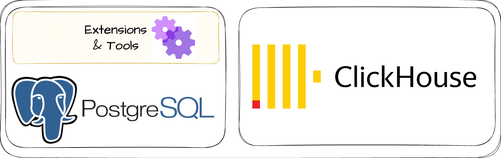

## Introduction
Chào mọi người, trong bài viết này Tuân sẽ chia sẻ đến mọi người `Data`

Hello everyone, in my livestreams on [my Tiktok channel](https://www.tiktok.com/@tuan.data),
I have noticed many followers who are interested in the Data Engineering Learning Path.
Therefore, in this blog, I will share with everyone about the `Data Engineering Learning Path in 2024` that I'm teaching in my course
`Mastering Data Engineering 2024`.

The sections below are arranged from basic to advanced, as well as by their level of importance.

I hope this blog will be helpful to everyone. If you have any questions, please feel free to email me at `contact.tuandata@gmail.com`  or sent me a message at [my facebook](https://www.facebook.com/edgarle611/).

## 1. What is Data Engineering?

## 2. SQL

First of all, it is SQL.

SQL is a crucial skill for Data Engineers because the first task of every Data Engineer is to adhoc report.
To retrieve requested adhoc reports effectively, Data Engineers need to have a solid understanding of both basic and advanced SQL concepts.

Understanding basic SQL help Data Engineers can adhoc reports as required. However, to save costs and efficiently adhoc report, Data Engineers need to have a deep understanding of advanced SQL techniques then optimize their query adhoc.

## 3. Python

The second is Python.

Python is the primary language for Data Engineers, so it is essential to master and understand it throughly.

Data Engineers use Python to write data processing pipelines to integrate data from various sources into Data Warehouse or Data Lake, in addition to transform data in ETL processes.

## 4. Git

The third is git.

## 5. Linux Command Line

## 6. Database Management System

## 7. Data Warehouse Concept

## 8. Big Data Framework

## 9. NoSQL Database

## 10. Cloud Services

## 11. DataOps

## 12. Data Visualization

## 13. Scalar

## Conclusion
I hope this explanation was clear and easy to understand for you to follow through the process.

