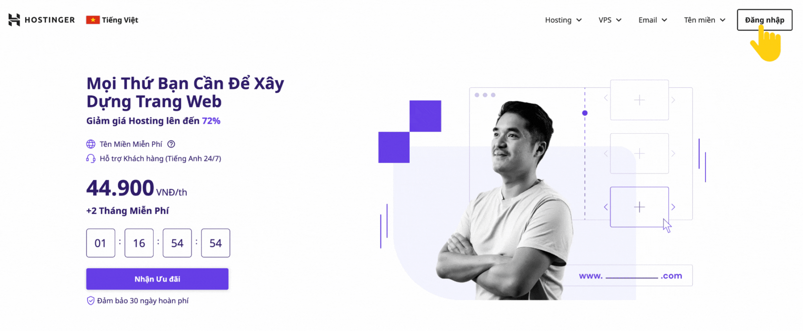
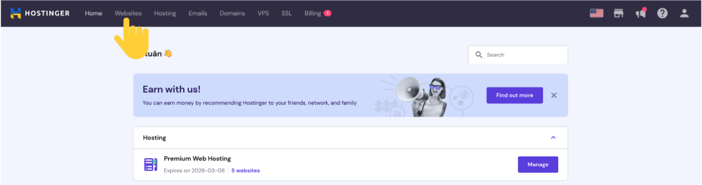
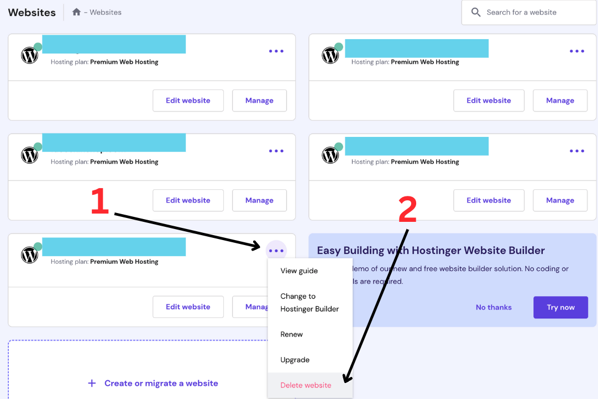
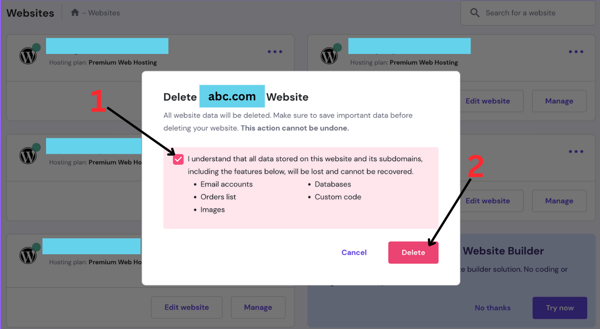

## Introduction
Hello everyone, today I would like to share about **"How to delete a website on Hostinger"**. I hope my following guide will be helpful to everyone.

## Step by step
### Step 1: Enter to Hostinger website then Login.

After loading the Hostinger website, please log in as usual to access your management panel.

### Step 2: Go to the "Website" section on the panel.

On the panel page, click on "Websites".

### Step 3: Select the website you want to delete and proceed with the deletion.

Follow the steps shown in the image above for the website you want to delete.

### Step 4: Confirm the deletion.

Follow the two steps shown in the image:
- Click on the "tick" box.
- Click on the "Delete" button.

The deletion process will take at most 1 minute to complete.

## Conclusion
I hope this explanation was clear and easy to understand for you to follow through the process.