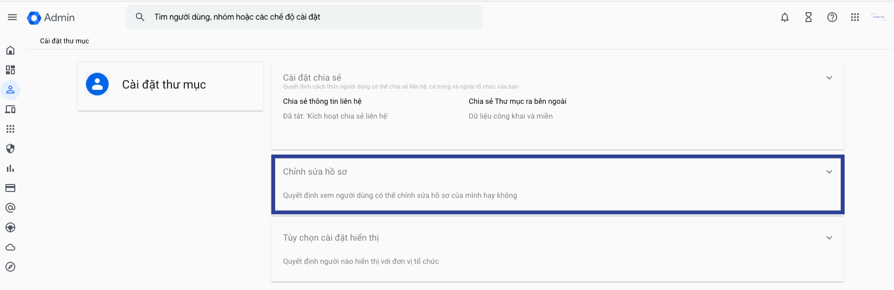
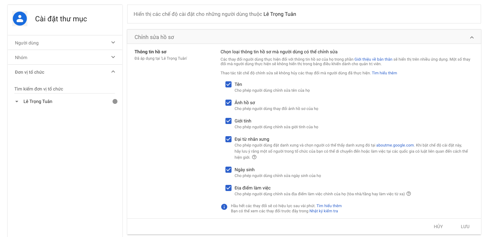

## Introduction
Hello everyone, today I would like to share about "Permission for user change avatar in Google Workspace" . I hope my following guide will be helpful to everyone.

## Problem
The thing is, I have an account in Google Workspace, but I couldn't change my profile picture no matter what (even though I used the admin account to try). After a few minutes of researching, I found out that it's because of security reasons; Google Workspace by default doesn't allow users to change their profile pictures.

## Solution
To change the profile picture, you need to reset the configuration at Google Workspace: [Google Workspace Manage Setting](https://admin.google.com/u/6/ac/managedsettings/986128716205). 

After accessing the admin settings page, click on the `Edit Profile` section as shown in the image below:

After that, you select the configurations as shown in the following image

And finally, you click on `Save` to save all configurations.

## Conclusion
I hope this explanation was clear and easy to understand for you to follow through the process.
