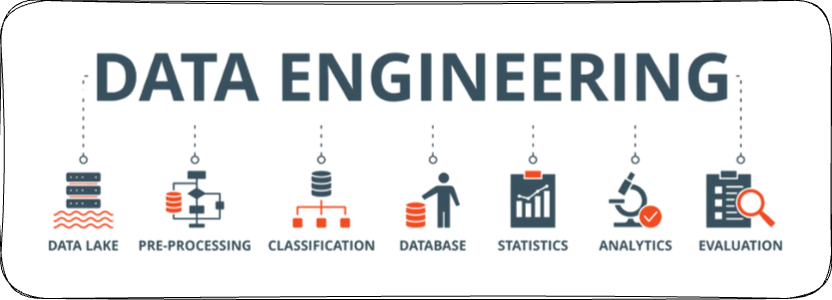
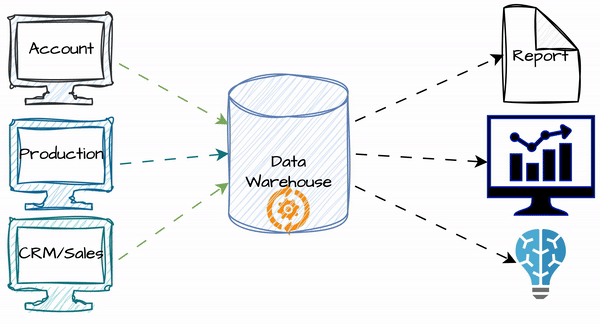
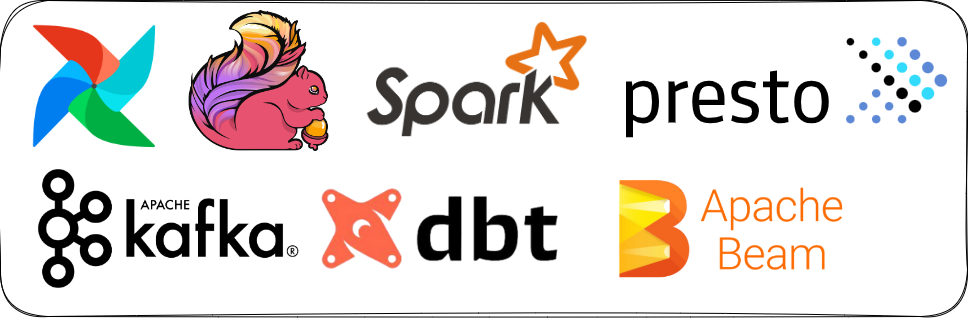
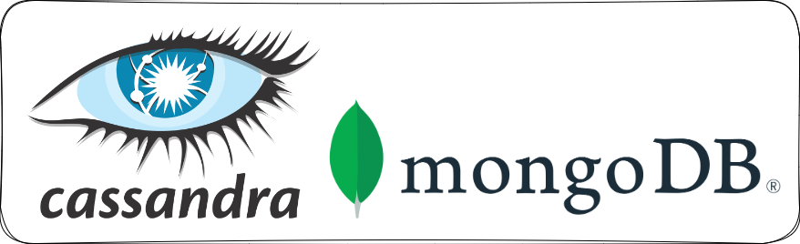
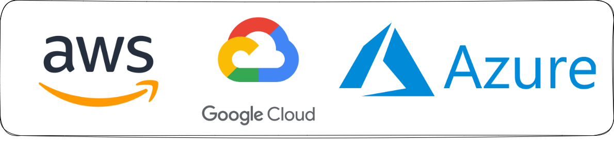
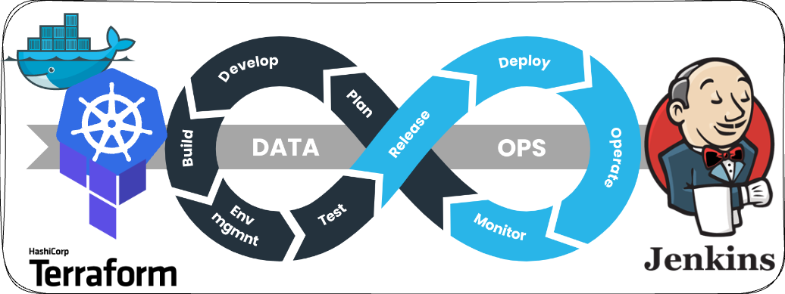
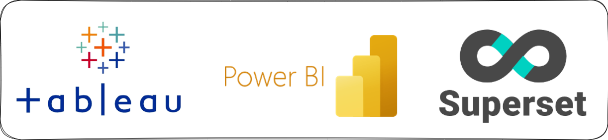
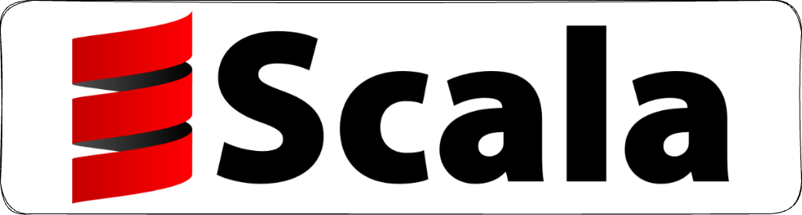

## Giới thiệu
Chào mọi người, trong những buổi livestream [trên kênh Tiktok của Tuân](https://www.tiktok.com/@tuan.data), Tuân thấy các bạn hay hỏi về `Cách học Data Engineering?` hoặc `Muốn làm Data Engineer thì cần học những gì?`.

Nên trong bài viết này Tuân sẽ chia sẻ đến mọi người về `Lộ trình học Data Engineering trong năm 2024`, lộ trình này được Tuân lấy ra từ khoá học `Mastering Data Engineering 2024` mà Tuân đang training cho những học viên của Tuân.

Thứ tự các phần bên dưới đã được Tuân sắp xếp theo thứ tự ưu tiên, cũng như là từ dễ đến khó. Vậy nên các bạn có thể bám sát vào học theo thứ tự này nhé!

Tuân hi vọng bài viết này sẽ hữu ích đến các bạn. Nếu các bạn có bất kỳ câu hỏi hoặc thắc mắc liên quan đến bài viết hoặc chủ đề về `Data Engineering`, hãy gửi mail cho Tuân tại địa chỉ mail [contact.tuandata@gmail.com](mailto:contact.tuandata@gmail.com) hoặc gửi tin nhắn đến [Facebook của Tuân](https://www.facebook.com/trtuan.data/) nhé!

Và bây giờ mình cùng nhau bắt đầu nào.

## 1. What is Data Engineering?

Đầu tiên và cũng là kiến thức quan trọng nhất khi các bạn tìm hiểu về Data Engineering hay nghề Data Engineer chính là hiểu về nghề, tìm hiểu về công việc của vị trí này là làm gì? Sự quan trọng của một Data Engineer trong một tổ chức? cũng như giá trị cốt lõi mà Data Engineer mang đến cho tổ chức.

Để từ đó các bạn mới biết được rằng liệu mình có thích nó như mình nghĩ không? Liệu rằng mình có phù hợp với nó không? Tránh bị mất thời gian, công sức cũng như tiền bạc quá nhiều vào nó, rồi một ngày lại nhận ra là mình không phù hợp với nó, không thích công việc này. Vậy nên, tuy đây là những kiến thức đơn giản nhất nhưng cũng thật sự quan trọng nhất đối với bạn.

### Nguồn tài liệu
Trong phần này bạn có thể tham khảo 2 nguồn tài liệu sau nhé:
- Sách `Fundamentals of Data Engineering`: Đây là quyển sách giới thiệu về nghề `Data Engineer` mà Tuân thấy tương đối đầy đủ cũng như thực tế nhất. Các bạn có thể đọc sách tại đây nhé [Oreilly](https://learning.oreilly.com/library/view/fundamentals-of-data/9781098108298/preface01.html#what_this_book_isn_t).

- `Module 1: Giới thiệu về Data Engineering` trong khoá học `Mastering Data Engineering 2024` do Tuân trực tiếp giảng dạy: Trong khoá học `Mastering Data Engineering 2024`, các bạn đăng ký tham gia sẽ được học miễn phí `Module 1: Giới thiệu về Data Engineering` để tìm hiểu về ngành cũng như tìm hiểu về khoá học trước khi đăng ký tham gia học sâu các kiến thức trong các Module sau. Để đăng ký các bạn liên hệ Tuân tại địa chỉ mail [contact.tuandata@gmail.com](mailto:contact.tuandata@gmail.com).

Nếu như bạn đã tìm hiểu đủ các thông tin, và thật sự cảm thấy thích thú với nghề `Data Engineer` thì chúc mừng bạn đã tìm được công việc yêu thích của mình và cùng Tuân bước vào các chặng đường phía trước nhé!

## 2. SQL

Kiến thức về technical đầu tiên chúng ta sẽ tìm hiểu là SQL nhé.

SQL là một kỹ năng quang trọng cho một Data Engineer, bởi vì công việc đầu tiên của Data Engineer là lấy report(công việc này hay được nói vui là **lấy số**). Mà hầu hết dữ liệu sẽ được lưu trữ ở **Data Warehouse**, vậy nên bạn muốn lấy dữ liệu ra thì bạn phải có kỹ năng SQL.

Biết được các kiến thức cơ bản SQL sẽ giúp bạn lấy được các report đơn giản, nhưng đối với các report phức tạp, yêu cầu tính toán nhiều cũng như phối hợp xử lý nhiều công đoạn thì bạn phải hiểu sâu về SQL biết các kiến thức nâng cao SQL.

Khi đã nắm rõ các kiến thức nâng cao này, cũng sẽ đồng thời giúp bạn tối ưu hoá các câu truy vấn, giúp cải thiện thời gian truy vấn cũng như resource khi thực thi câu truy vấn.

### Nguồn tài liệu
Trong phần này bạn có thể tham khảo 2 nguồn tài liệu sau nhé:
- Cú pháp SQL trong [Google BigQuery](https://cloud.google.com/bigquery/docs/reference/standard-sql/query-syntax?authuser=1): Đây là trang web giới thiệu cũng như hướng dẫn các cú pháp SQL trong Google BigQuery. 

- `Module 2: Sử dụng SQL để truy vấn dữ liệu` trong khoá học `Mastering Data Engineering 2024` do Tuân trực tiếp giảng dạy: Trong module này các bạn học viên sẽ được học midset về truy vấn dữ liệu, các câu lệnh SQL từ cơ bản đến nâng cao, cũng như những kỹ thuật tối ưu hoá câu truy vấn. Để đăng ký các bạn liên hệ Tuân tại địa chỉ mail [contact.tuandata@gmail.com](mailto:contact.tuandata@gmail.com).

> Trong phần này, các học viên của Tuân cũng thường có câu hỏi rằng những câu truy vấn SQL trên Google BigQuery có khác gì với những nền tảng Data Warehouse khác như Snowflake hoặc những database khác như PostgreSQL, MySQL không? Thì Tuân xin trả lời với các bạn rằng có nhé, nhưng rất ít, và hầu như đều giống nhau cả. Chỉ khác ở những hàm xử lý phức tạp, vì mỗi database sẽ hỗ trợ những hàm xử lý khác nhau thôi. Vậy nên chỉ cần bạn nắm chắc được một nền tảng thì rất dễ để sử dụng trên các nền tảng khác.

## 3. Python

Kiến thức về technical thứ hai chúng ta sẽ tìm hiểu là Python nhé.

Python là ngôn ngữ lập trình chính cho các Data Engineer. Data Engineer sử dụng Python kết hợp với các thư viện của Python để xây dựng các pipeline xử lý dữ liệu hay các luồng ETL, ELT data. Nhằm mục tiêu xây dựng một Data Platform hoàn thiện.

### Nguồn tài liệu
Trong phần này bạn có thể tham khảo các nguồn tài liệu sau nhé:
- [Tutorial Python tại Programiz](https://www.programiz.com/python-programming): Bạn có thể dựa bám sát tutorial này để học lập trình Python cơ bản nhé.
- Sách [Python Crash Course](https://www.amazon.com/Python-Crash-Course-Eric-Matthes/dp/1718502702): Đây là một quyển sách học Python tương đối đầy đủ cho các bạn mới tập làm quen với lập trình Python.
- [Tài liệu Pandas](https://pandas.pydata.org/docs/reference/io.html): Sau khi đã nắm được các kiến thức cơ bản Python bạn học tiếp kiến thức về sử dụng Pandas để sử lý dữ liệu nhé.
- [Tài liệu Numpy](https://numpy.org/doc/stable/reference/module_structure.html): Còn đây là tài liệu về thư viện Numpy nhé.
- Ngoài ra còn có các thư viện khác phục vụ cho extract cũng như load dữ liệu như: ftplib, psycopg2, ...
- `Module 3: Lập trình Python cho Data Engineer` trong khoá học `Mastering Data Engineering 2024` do Tuân trực tiếp giảng dạy: Trong module này học viên sẽ học midset về lập trình cũng như lập trình Python, sử dụng ngôn ngữ lập trình Python để giải quyết các bài toán thực tế Data Engineering. Để đăng ký các bạn liên hệ Tuân tại địa chỉ mail [contact.tuandata@gmail.com](mailto:contact.tuandata@gmail.com).

## 4. Git

Kiến thức về technical thứ ba chúng ta sẽ tìm hiểu là Git nhé.

Git là một công cụ thường được sử dụng để quản lý source code trong các doanh nghiệp, giúp các member trong team có thể làm việc chung với nhau trong cùng một source code, tránh phải giẫm chân nhau.

Vậy nên khi tham gia vào một team, bạn cũng đồng thời join vào những project của team. Nên kiến thức về Git thật sự rất cần thiết với các bạn, giúp các bạn có thể tự tin làm việc cùng các member trong team cũng như cùng chung tay xây dựng projects của team.

### Nguồn tài liệu
Trong phần này bạn có thể tham khảo 2 nguồn tài liệu sau nhé:
- [Tutorial Git tại W3School](https://www.w3schools.com/git/): Bạn có thể bám sát tutorial này để thực hành với Git nhé.
- `Module 4: Data Engineer sử dụng Git để quản lý source code` trong khoá học `Mastering Data Engineering 2024` do Tuân trực tiếp giảng dạy: Trong module này học viên sẽ được học cách làm việc với Git và sử dụng Git để giải quyết các vấn đề thường gặp trong thực tế cũng như các bug thường mắc phải khi sử dụng Git. Để đăng ký các bạn liên hệ Tuân tại địa chỉ mail [contact.tuandata@gmail.com](mailto:contact.tuandata@gmail.com).

## 5. Linux Command Line & Bash Script

Kiến thức về technical thứ tư chúng ta sẽ tìm hiểu là Linux Command Line và Bash Script nhé.

Nghe hơi lạ đúng không các bạn? Data Engineer thì cần gì biết đến Linux Command Line hay Bash Script, chỉ cần biết những kiến thức liên quan đến Data là được rồi mà. Nhưng thật sự như vậy, Linux Command Line cũng như Bash Script có liên quan rất mật thiết đến Data Engineer.

Ví dụ đơn giản như thế này, những service mà Data Engineer dùng hầu hết sẽ được deploy trên nền tảng Linux OS. Vì vậy khi biết những cây lệnh Linux sẽ giúp ích cho các bạn rất nhiều trong việc tương tác hay làm việc trên các Linux Server. Nhất là trong môi trường On-Premise.

### Nguồn tài liệu
Trong phần này bạn có thể tham khảo các nguồn tài liệu sau nhé:
- [Tutorial Linux Command Line](https://www.freecodecamp.org/news/linux-command-line-tutorial/): Bạn có thể tham khảo các hướng dẫn cơ bản cũng như làm quen với các lệnh Linux thường sử dụng tại Tutorial này.
- [Tutorial Bash Script](https://www.freecodecamp.org/news/bash-scripting-tutorial-linux-shell-script-and-command-line-for-beginners/#:~:text=A%20bash%20script%20is%20a,process%20using%20the%20command%20line.): Bạn có thể tham khảo các hướng dẫn cơ bản về Bash Script tại Tutorial này nhé.
- `Module 5: Kiến thức Linux cho Data Engineer` trong khoá học `Mastering Data Engineering 2024` do Tuân trực tiếp giảng dạy: Trong module này học viên sẽ được học về 2 hệ điều hành Linux thường được sử dụng chính trong có dự án Data của doanh nghiệp là Ubuntu và CentOS, các câu lệnh thường được sử dụng cho công việc Data Engineering và các công cụ giúp tăng hiệu suất khi làm việc trên Linux. Và cuối cùng học viên sẽ được học về Bash Script, sử dụng Bash Script để giải quyết các vấn đề thực tế cho công việc Data Engineering. Để đăng ký các bạn liên hệ Tuân tại địa chỉ mail [contact.tuandata@gmail.com](mailto:contact.tuandata@gmail.com).

## 6. Database Management System

Kiến thức về technical thứ năm chúng ta sẽ cần tìm hiểu là Database Management System(DBMS).

Trong phần 2 `SQL`, chúng ta đã tìm hiểu về SQL, nhưng đó chỉ tập trung đào sâu vào phần truy vấn dữ liệu, phục vụ cho việc xử lý dữ liệu bằng SQL hoặc lấy các adhoc report.

Trong phần này chúng ta sẽ chia ra làm 2 phần nhỏ nhé, đó là: `Phần 1: Kiến thức Database Management System cho người chỉ sử dụng` và `Phần 2: Kiến thức Database Management cho người setup (DataOps)`.

Với phần 1, các bạn sẽ học các kiến thức về DBMS để giải quyết các câu hỏi như: `Thiết kế một DBMS như thế nào?`, `Quy trình thiết kế DBMS như thế nào?`, `Hoạt động của một DBMS như thế nào?`, `Lưu trữ Data trong một DB như thế nào cho hiệu quả?`, ... những câu hỏi này chỉ mục đích sử dụng một DBMS được build sẵn lên một cách tốt nhất, ngoài ra không động chạm gì phần dưới setup hệ thống DBMS cả.

Đối với các bạn mới bắt đầu học về Data Engineering, mục tiêu chỉ đạt được level Fresher hoặc Junior, thì chỉ cần xem kỹ phần 1 này là đã đủ kiến thức để chiến rồi. Nếu các bạn thích mày mò, tìm hiểu sâu các kiến thức thì hãy tiếp đến phần 2 nhé, vì phần 2 này sẽ hơi `Ác` và `Chiến` đấy, vậy nên phải cẩn thận.

Với phần 2, các bạn sẽ học các kiến thức về việc setup các DBMS một cách hiệu quả cũng như các kiến thức về System Design. Phần này phù hợp cho các bạn đã nắm kỹ phần 1 và muốn đào sâu vào bên dưới hệ thống của DBMS. Cũng như làm sao xây dựng một Data Warehouse On-Premise.

Trong phần này, Tuân recommend các bạn nên tập trung vào 2 Database hiện tại rất phổ biến với dân Data Engineer, đó là `PostgreSQL` và `Clickhouse`, 1 con là Database lưu trữ data theo dạng row, 1 con lưu trữ data theo dạng column.

### Nguồn tài liệu
Trong phần này bạn có thể tham khảo các nguồn tài liệu sau nhé:
- Sách [Fundamentals of Database Systems](https://www.amazon.com/Fundamentals-Database-Systems-Ramez-Elmasri/dp/0133970779): Đây là một quyển sách nói rõ các vấn đề liên quan đến Database cũng như DBMS.
- Sách [Database Systems: The Complete Book](https://www.amazon.com/Database-Systems-Complete-Book-2nd/dp/0131873253): Đây cũng là một quyển sách hay nói về DBMS.
- Sách [Designing Data-Intensive Applications](https://www.amazon.com/Designing-Data-Intensive-Applications-Reliable-Maintainable/dp/1449373321/ref=ci_mcx_mr_mp_m_d_sccl_2_2/144-2643349-2668312?pd_rd_w=jl7pT&content-id=amzn1.sym.904f4c18-630f-4c52-8bdf-78921242d9bd:amzn1.symc.27c848cf-47ab-487b-bd07-91bc659e0119&pf_rd_p=904f4c18-630f-4c52-8bdf-78921242d9bd&pf_rd_r=T5NM3R82XDZC06189DFD&pd_rd_wg=LVhXF&pd_rd_r=8959001b-311f-474a-883d-e664a4652f9a&pd_rd_i=1449373321&psc=1): Đây là một quyển sách hay nói về các khía cạnh trong System Design.
- [Tài liệu PostgreSQL Database](https://www.postgresql.org/docs/16/index.html): Đây là nguồn tài liệu chính thống từ PostgreSQL Database.
- [Tài liệu Clickhouse Database](https://clickhouse.com/docs/en/intro): Đây là nguồn tài liệu chính thống từ Clickhouse Database.
- `Module 6.1: Database Management System cơ bản` trong khoá học `Mastering Data Engineering 2024` do Tuân trực tiếp giảng dạy: Trong module này học viên sẽ được học về các kiến thức về thiết kế Database cũng như các câu lệnh SQL để quản trị một Database hiệu quả.  Để đăng ký các bạn liên hệ Tuân tại địa chỉ mail [contact.tuandata@gmail.com](mailto:contact.tuandata@gmail.com).
- `Module 6.2: Thiết kế và xây dựng PostgreSQL Database cluster mạnh mẽ` trong khoá học `Mastering Data Engineering 2024` do Tuân trực tiếp giảng dạy: Trong module này học viên sẽ được học về các vấn đề trong System Design từ đó áp dụng trong việc thiết kế, xây dựng và tối ưu một cụm PostgreSQL Database phục vụ cho mục đích làm Data Warehouse hiệu quả.  Để đăng ký các bạn liên hệ Tuân tại địa chỉ mail [contact.tuandata@gmail.com](mailto:contact.tuandata@gmail.com).
- `Module 6.3: Clickhouse cho Data Engineer` trong khoá học `Mastering Data Engineering 2024` do Tuân trực tiếp giảng dạy: Trong module này học viên sẽ được học về cách sử dụng Clickhouse, mindset để thực thi các câu truy vấn trong Clickhouse hiệu quả, các vấn đề trong System Design từ đó áp dụng trong việc thiết kế, xây dựng và tối ưu một cụm Clickhouse Database phục vụ cho mục đích làm Data Warehouse hiệu quả.  Để đăng ký các bạn liên hệ Tuân tại địa chỉ mail [contact.tuandata@gmail.com](mailto:contact.tuandata@gmail.com).
- Đối với các bạn muốn đào sâu hơn nữa, thì hãy nghiên cứu sâu những Database sau nhé: `Apache Druid`, `Apache Pinot`, `YugabyteDB`, `Apache Doris`, `StarRocks`, `DuckDB`, `Apache Hudi`, `Apache Iceberg`, `Delta Lake`.  Biết nhiều loại sẽ giúp bạn có giải pháp tốt hơn để giải quyết một vấn đề, bởi vì mỗi loại đều có những ưu và nhược điểm riêng. Không có cái nào là tốt nhất cả, chỉ có giải pháp phù hợp nhất.

## 7. Data Warehouse Concept

Kiến thức về technical thứ sáu chúng ta sẽ cần tìm hiểu là các kiến thức về Data Warehouse.

Trong phần sáu này, chúng ta sẽ cùng nhau tìm hiểu về các khái niệm cũng như kiến thức về Data Warehouse như: ETL, ELT, OLAP, OLTP, Metadata, Dimension model, Start Schema, Snowflake Schema, Slowly Changing Dimension, các concept về Data Model, Logical Data Model, Phisical Data Model, ...

Mục tiêu của phần này giúp cho các bạn nắm được tại sao lại cần Data Warehouse; thiết kế một Data Warehouse như thế nào; các khái niệm khái như Data Lake, Data Mart, Data Lakehouse, Data Mesh là sao; tất tần tật các khái niệm liên quan đến việc lưu trữ Big Data trong một Data Platform.

### Nguồn tài liệu
Trong phần này bạn có thể tham khảo các nguồn tài liệu sau nhé:
- Sách [The Data Warehouse Toolkit](https://www.amazon.com/Data-Warehouse-Toolkit-Definitive-Dimensional/dp/1118530802/ref=sims_dp_d_dex_popular_subs_t3_v3_d_sccl_2_4/144-2643349-2668312?pd_rd_w=jpZAU&content-id=amzn1.sym.f397bf17-0109-424d-bb2c-23c632716f37&pf_rd_p=f397bf17-0109-424d-bb2c-23c632716f37&pf_rd_r=3NV7PM5J8QHT1W7EG2KK&pd_rd_wg=gqeGL&pd_rd_r=ba20de1a-46bc-407e-8d27-cb378576c4b4&pd_rd_i=1118530802&psc=1): Đây là một quyển sách đầy đủ nói về các khái niệm trong Data Warehouse mà các bạn nên tham khảo.
- `Module 7: Data Warehouse Concept` trong khoá học `Mastering Data Engineering 2024` do Tuân trực tiếp giảng dạy: Trong module này học viên sẽ được học các khái niệm liên quan đến Data Warehouse cũng như các cách tổ chức dữ liệu lưu trữ hợp lý bên trong Data Warehouse. Sau khi đã nắm chắc các kiến thức này, học viên sẽ được mở rộng sang các khái niệm liên quan như Data Mart, Data Lake, Data Lakehouse, Data Mesh. Để đăng ký các bạn liên hệ Tuân tại địa chỉ mail [contact.tuandata@gmail.com](mailto:contact.tuandata@gmail.com).

## 8. Big Data Framework

Kiến thức về technical thứ bảy chúng ta sẽ cần tìm hiểu là kiến thức liên quan đến các công cụ sử dụng để xử lý Big Data cũng như tương tác với Big Data.

Các công cụ phổ biến thì Tuân cũng đã show trong hình mô tả rồi nhé mọi người. Lưu ý rằng tuỳ mục tiêu của các bạn mà nên sắp xếp học hợp lý nhé!

Đối với những bạn mục tiêu level Fresher/ Junior, ưu tiên học Airflow đầu tiên, rồi tiếp đến là Kafka, rồi Spark, rồi DBT nhé.

Nếu các bạn đã quen với các công cụ đã kể ở trên, muồn bổ sung kiến thức thêm thì các bạn có thể xem tiếp các công cụ còn lại nhé!

### Nguồn tài liệu
Trong phần này bạn có thể tham khảo các nguồn tài liệu sau nhé:
- Phần lớn các công cụ được Tuân liệt kê ở trên sẽ có Document cụ thể cả, các bạn có thể vào trang Document của từng công cụ mà xem chi tiết nhé.
- `Module 8.1: Airflow cho Data Engineer` trong khoá học `Mastering Data Engineering 2024` do Tuân trực tiếp giảng dạy: Trong module này học viên sẽ được học cách setup và config Airflow trên môi trường Production cũng như các kiến thức sử dụng Airflow để giải quyết các bài toán thực tế Data Engineering. Để đăng ký các bạn liên hệ Tuân tại địa chỉ mail [contact.tuandata@gmail.com](mailto:contact.tuandata@gmail.com).
- `Module 8.2: Kafka cho Data Engineer` trong khoá học `Mastering Data Engineering 2024` do Tuân trực tiếp giảng dạy: Trong module này học viên sẽ được học cách setup và config Kafka trên môi trường Production cũng như các kiến thức liên quan đến việc sử dụng Kafka để giải quyết các bài toán thực tế Data Engineering. Để đăng ký các bạn liên hệ Tuân tại địa chỉ mail [contact.tuandata@gmail.com](mailto:contact.tuandata@gmail.com).
- `Module 8.3: Spark cho Data Engineer` trong khoá học `Mastering Data Engineering 2024` do Tuân trực tiếp giảng dạy: Trong module này học viên sẽ được học cách setup và config Spark trên môi trường Production cũng như các kiến thức liên quan đến việc sử dụng Spark để giải quyết các bài toán thực tế Data Engineering. Để đăng ký các bạn liên hệ Tuân tại địa chỉ mail [contact.tuandata@gmail.com](mailto:contact.tuandata@gmail.com).
- `Module 8.4: DBT cho Data Engineer` trong khoá học `Mastering Data Engineering 2024` do Tuân trực tiếp giảng dạy: Trong module này học viên sẽ được học cách setup và config DBT trên môi trường Production cũng như các kiến thức liên quan đến việc sử dụng DBT để giải quyết các bài toán thực tế Data Engineering. Để đăng ký các bạn liên hệ Tuân tại địa chỉ mail [contact.tuandata@gmail.com](mailto:contact.tuandata@gmail.com).
- `Module 8.5: Flink cho Data Engineer` trong khoá học `Mastering Data Engineering 2024` do Tuân trực tiếp giảng dạy: Trong module này học viên sẽ được học cách setup và config Flink trên môi trường Production cũng như các kiến thức liên quan đến việc sử dụng Flink để giải quyết các bài toán thực tế Data Engineering. Để đăng ký các bạn liên hệ Tuân tại địa chỉ mail [contact.tuandata@gmail.com](mailto:contact.tuandata@gmail.com).

## 9. NoSQL Database

Trong phần này chúng ta sẽ đi tìm hiểu về NoSQL Database nhé mọi người.

Đối với những bạn mục tiêu level Fresher/ Junior thì không cần đào sâu vào các Database này đâu nhé. Chỉ cần hiểu được thế nào là NoSQL cũng như sự khác biệt với các Relational Database khác; kèm với đó là nó giải quyết bài toán gì.

Nếu bạn muốn đào sâu vào phần này, thì Tuân có reccommend cho bạn 2 NoSQL phổ biến với Data Engineer đó là Cassandra và MongoDB nhé.

### Nguồn tài liệu
Trong phần này bạn có thể tham khảo các nguồn tài liệu sau nhé:
- [Giới thiệu về NoSQL Database](https://www.ibm.com/topics/nosql-databases): Bạn có thể tham khảo tài liệu từ IBM để nắm các kiến thức cơ bản của NoSQL nhé.
- [Tài liệu MongoDB](https://www.mongodb.com/docs/manual/): Đây là document của MongoDB, nếu như các bạn muốn tìm hiểu sâu về MongoDB nhé.
- [Tài liệu Cassandra](https://cassandra.apache.org/_/resources.html): Đây là tổng hợp các tài liệu liên quan đến việc tìm hiểu về Cassandra nếu như các bạn muốn tìm hiểu sâu về Cassandra nhé.
- `Module 9: NoSQL Database cho Data Engineer` trong khoá học `Mastering Data Engineering 2024` do Tuân trực tiếp giảng dạy: Trong module này học viên sẽ được học các kiến thức liên quan đến NoSQL Database cũng như các công việc thực tế của Data Engineer liên quan đến NoSQL Database. Để đăng ký các bạn liên hệ Tuân tại địa chỉ mail [contact.tuandata@gmail.com](mailto:contact.tuandata@gmail.com).

## 10. Cloud Services

Trong phần này, chúng ta sẽ cùng tìm hiểu về các Cloud Service được cung cấp bởi các Cloud Provider phục vụ cho Data Engineering.

Như trong hình mô tả, hiện tại trên thị trường có 3 Cloud Provider chính, đó là AWS, GCP và Azure.

Nếu bạn là người mới tìm hiểu hoặc đặt mục tiêu cho mình ở mức level Fresher/ Junior, thì cứ chọn một provider bất kỳ trong 3 cloud trên, rồi tiến hành học các service thường sử dụng cho Data Engineering như sau:

- AWS 
    - Amazon S3
    - Amazon EC2
    - AWS Glue
    - Amazon RedShift
    - Amazon EMR
    - AWS LambdaAWS Lambda

- GCP
    - Google Cloud Data Fusion
    - Google Compute Engine
    - Google BigQuery
    - Google Cloud Dataproc
    - Google Cloud Storage
    - Google Cloud SQL

- Azure:
    - Azure Data Factory
    - Azure Virtual Machine
    - Azure Synapse
    - Azure Databricks
    - Azure Blob Storage
    - Azure Data Lake Storage Gen2
    - Azure SQL Database

### Nguồn tài liệu
Trong phần này bạn có thể tham khảo các nguồn tài liệu sau nhé:
- [Tài liệu các service AWS](https://docs.aws.amazon.com/): Đây là trang hướng dẫn cũng như các thông tin về các service hiện có của AWS. Bạn cần tìm hiểu service nào thì cứ search rồi đọc nhé.
- [Tài liệu các service GCP](https://cloud.google.com/docs/): Đây là trang hướng dẫn cũng như các thông tin về các service hiện có của GCP.
- [Tài liệu các service Azure](https://learn.microsoft.com/en-us/azure/?product=popular): Đây là trang hướng dẫn cũng như các thông tin về các service hiện có của Azure.
- `Module 10.1: AWS cho Data Engineer` trong khoá học `Mastering Data Engineering 2024` do Tuân trực tiếp giảng dạy: Trong module này các bạn sẽ được học về các service trên nền tảng cloud AWS phục vụ cho các công việc liên quan Data Engineering. Để đăng ký các bạn liên hệ Tuân tại địa chỉ mail [contact.tuandata@gmail.com](mailto:contact.tuandata@gmail.com).
- `Module 10.2: GCP cho Data Engineer` trong khoá học `Mastering Data Engineering 2024` do Tuân trực tiếp giảng dạy: Trong module này các bạn sẽ được học về các service trên nền tảng cloud GCP phục vụ cho các công việc liên quan Data Engineering. Để đăng ký các bạn liên hệ Tuân tại địa chỉ mail [contact.tuandata@gmail.com](mailto:contact.tuandata@gmail.com).

## 11. DataOps

Trong phần này, chúng ta sẽ cùng nhau tìm hiểu về các kiến thức liên quan đến việc deploy, vận hành cũng như monitor các service trong một Data Platform. Nhằm đảm bảo 
Data Platform được hoạt động tốt. Các công việc này được gọi là DataOps hay Data Operations.

Đối với một team Data lớn (số lượng member trong team nhiều, quản lý và phát triển nhiều project data phức tạp), thì sẽ có hẵn những bạn đảm nhiệm vị trí DataOps Engineer. Công việc của các bạn DataOps Engineer này sẽ hỗ trợ build cũng như optimize các service, nhằm đảm bảo tạo một môi trường tốt nhất cho các bạn Data Engineer phát huy sở trường của mình trong việc thu thập, xử lý, lưu trữ cũng như hỗ trợ tốt cho các bạn Data Analyst, Data Scientist khai thác dữ liệu một cách tốt nhất.

Đối với các team không có vị trí DataOps Engineer chính thức, thì những công việc này sẽ được san sẻ giữa các bạn trong team DevOps và các bạn Data Engineer trong team Data. 

Trong phần này chúng ta sẽ không đi sâu vào các kiến thức về DataOps nhé, chúng ta chỉ tìm hiểu những kiến thức về DataOps cần thiết đối với một Data Engineer, đủ để Data Engineer dùng thôi nhé.

Đối với các bạn mục tiêu level Fresher/ Junior thì chưa cần thiết phải xem phần này nhé!

Các công cụ trong phần này chúng ta sẽ học gồm như sau:

- Docker
- Kubernetes
- Jenkins
- Terraform

### Nguồn tài liệu
Trong phần này bạn có thể tham khảo các nguồn tài liệu sau nhé:
- [Sách Docker Deep Dive](https://learning.oreilly.com/library/view/docker-deep-dive/9781835081709/): Đây là một quyển sách đề cập đầy đủ các kiến thức về Docker.
- [Sách The Book of Kubernetes](https://learning.oreilly.com/library/view/the-book-of/9781098141394/): Một quyển sách nói về Container và Kubernetes chi tiết cho người mới bắt đầu.
- [Tài liệu Jenkins](https://www.jenkins.io/doc/book/getting-started/): Tại đây các bạn có thể tìm hiểu về Jenkins từ cơ bản nhé.
- [Tài liệu Terraform](https://developer.hashicorp.com/terraform?product_intent=terraform): Trang tài liệu của Terraform.
- `Module 11.1: Docker cho Data Engineer` trong khoá học `Mastering Data Engineering 2024` do Tuân trực tiếp giảng dạy: Trong module này các bạn sẽ được học về các kiến thức về Docker, Docker container, Docker compose và các vấn đề thực tế liên quan đến Data Engineering. Để đăng ký các bạn liên hệ Tuân tại địa chỉ mail [contact.tuandata@gmail.com](mailto:contact.tuandata@gmail.com).
- `Module 11.2: Kubernetes cho Data Engineer` trong khoá học `Mastering Data Engineering 2024` do Tuân trực tiếp giảng dạy: Trong module này các bạn sẽ được học về các kiến thức về việc sử dụng Kubernetes trong việc deploy, monitor cũng như quản lý các service liên quan đến Data Engineering. Để đăng ký các bạn liên hệ Tuân tại địa chỉ mail [contact.tuandata@gmail.com](mailto:contact.tuandata@gmail.com).
- `Module 11.3: Jenkins cho Data Engineer` trong khoá học `Mastering Data Engineering 2024` do Tuân trực tiếp giảng dạy: Trong module này các bạn sẽ được học về các kiến thức về việc sử dụng Jenkins trong việc CI/CD các project liên quan đến Data Engineering. Để đăng ký các bạn liên hệ Tuân tại địa chỉ mail [contact.tuandata@gmail.com](mailto:contact.tuandata@gmail.com).
- `Module 11.4: Terraform cho Data Engineer` trong khoá học `Mastering Data Engineering 2024` do Tuân trực tiếp giảng dạy: Trong module này các bạn sẽ được học về các kiến thức về việc sử dụng Terraform để triển khai infra liên qua đến các service Data Engineering trên các cloud provider bằng script. Để đăng ký các bạn liên hệ Tuân tại địa chỉ mail [contact.tuandata@gmail.com](mailto:contact.tuandata@gmail.com).

## 12. Data Visualization

Trong phần này chúng ta sẽ cùng nhau tìm hiểu về các công cụ được sử dụng phổ biến để visualize data.

Hiện tại, trên thị trường sẽ có 3 công cụ phổ biến như sau: Tableau, PowerBI và Superset. Trong đó Tableau và PowerBI là 2 công cụ trả phí, còn Superset là công cụ được Opensource nhé.

Nếu là người mới thì các bạn nên chọn học cũng như tìm hiểu Tableau hoặc PowerBI trước nhé, bởi vì 2 thằng này được sử dụng phổ biến hơn Superset. Sau đó có thời gian thì các bạn có thể xem thêm về Superset.

Mục tiêu phần này, chúng ta sẽ tìm hiểu cách sử dụng các công cụ trên ở level cơ bản thôi nhé, làm sao biết sử dụng nó để vẽ được những chart phù hợp cũng như biết cách tạo các Dashboard, cũng như cài các driver liên quan để phục vụ việc connect đến các data source.

Các bạn sẽ thấy khó hiểu tại sao Data Engineer lại phải biết các công cụ Visualize này đúng không? Khi bạn biết các kiến thức cơ bản về các công cụ Visualize này sẽ giúp bạn giao tiếp với các bạn Data Analyst dễ dàng hơn, cũng như sẽ biết được những khó khăn của các bạn Data Analyst. Từ đó có thể phục vụ các bạn Data Analyst tốt hơn bằng những việc đơn giản như thiết kế các Table hoặc các View phù hợp hơn.

Lưu ý, Đối với các bạn mục tiêu level Fresher/ Junior thì chưa cần xem phần này.

### Nguồn tài liệu
- [Khoá học Tableau trên Youtube](https://www.youtube.com/watch?v=K3pXnbniUcM&ab_channel=DatawithBaraa): Đây là một khoá học về Tableau miễn phí trên Youtube, tuy miễn phí những chất lượng kiến thức thì rất đầy đủ.
- [Tutorial PowerBI trên Youtube](https://www.youtube.com/watch?v=g0m5sEHPU-s&list=PLUaB-1hjhk8HqnmK0gQhfmIdCbxwoAoys&ab_channel=AlexTheAnalyst): Đây là một chuỗi video tutorial hướng dẫn về sử dụng PowerBI cho người mới trên nền tảng Youtube.
- [Tài liệu Superset](https://superset.apache.org/docs/intro): Đây là trang tài liệu Superset, nơi bạn có thể tìm hiểu tất tần tật về công cụ này.
- `Module 12.1: Tableau cho Data Engineer` trong khoá học `Mastering Data Engineering 2024` do Tuân trực tiếp giảng dạy: Trong module này các bạn sẽ được học các kiến thức cơ bản của Tableau, các vấn đề liên quan đến Tableau trong công việc hằng ngày, cách sử dụng Tableau cũng như xây dựng các Dashboard đơn giản bằng Tableau. Để đăng ký các bạn liên hệ Tuân tại địa chỉ mail [contact.tuandata@gmail.com](mailto:contact.tuandata@gmail.com).
- `Module 12.2: Superset cho Data Engineer` trong khoá học `Mastering Data Engineering 2024` do Tuân trực tiếp giảng dạy: Trong module này các bạn sẽ được học các kiến thức cơ bản của Superset, các vấn đề liên quan đến Superset trong công việc hằng ngày, cách sử dụng Superset cũng như xây dựng các Dashboard đơn giản bằng Superset và customize Superset. Để đăng ký các bạn liên hệ Tuân tại địa chỉ mail [contact.tuandata@gmail.com](mailto:contact.tuandata@gmail.com).

## 13. Scala

Trong phần này chúng ta sẽ cùng nhau tìm hiểu về ngôn ngữ lập trình Scala.

Lưu ý, những bạn đặt mục tiêu Fresher/ Junior thì không cần phải xem phần này. Nhưng nếu các bạn thích tìm hiểu cũng như có thời gian thì cứ học để biết thêm nhé, vì biết thêm không bao giờ là thừa cả.

Có lẽ các bạn sẽ thắc mắc: "tại sao đã có Python làm ngon lành rồi, lại đi học thêm ngôn ngữ lập trình Scala này làm gì nữa?".

Trước đây Tuân cũng có những thắc mắc như vậy. Để trả lời được câu hỏi này, Tuân đã tìm hiểu sâu về 2 ngôn ngữ lập trình Python và Scala cũng như tìm hiểu sâu về các công cụ xử lý dữ liệu lớn phổ biến như Spark, Flink và tìm ra câu trả lời cho chính mình như sau:

- Đầu tiên, khi các bạn biết thêm được ngôn ngữ Scala thì các bạn sẽ có nhiều cơ hội hơn để tham gia vào các dự án khác nhau; không phải bị phụ thuộc chỉ ngôn ngữ Python.
- Thứ hai, khi bạn tham gia vào dự án mà ngôn ngữ được dùng là Scala thì bạn phải có kinh nghiệm về Scala thì mới có thể tiếp tục maintain cũng như đóng góp phát triển dự án trong tương lai.
- Và thứ ba, tại sao có những dự án lại chọn Scala làm ngôn ngữ để phát triển, chứ không phải Python? Nguyên nhân là do đặc thù của ngôn ngữ Python sẽ không thật sự tối ưu về performance khi xử lý các bài toán với lượng dữ liệu lớn (chi tiết tại sao mình sẽ làm một bài phân tích sau nhé), và thứ 2 là vì công nghệ và dự án này chọn là gì, ví dụ Spark. Thì Spark có thể sử dụng bởi Python và cả Scala nhưng với Scala thì thời gian xử lý sẽ nhanh hơn, nhất là khi sử dụng User Defined Functions(UDF). Nói chung là sử dụng Scala vì quan tâm đến hiệu năng xử lý dữ liệu lớn hiệu quả hơn.

### Nguồn tài liệu
- [Trang tài liệu Scala](https://docs.scala-lang.org/): Các bạn có thể vào trang này để học về Scala nhé.
- [Sách Functional Programming in Scala](https://learning.oreilly.com/library/view/functional-programming-in/9781617299582/): Bạn có thể tham khảo quyển sách này nhé.
- [Sách Data Engineering with Scala and Spark](https://learning.oreilly.com/library/view/data-engineering-with/9781804612583/): Bạn có thể tham khảo quyển sách này để làm quen với sử dụng Scala cho Spark.
- `Module 13: Scala cho Data Engineer` trong khoá học `Mastering Data Engineering 2024` do Tuân trực tiếp giảng dạy: Trong module này các bạn sẽ được học các kiến thức về lập trình bằng ngôn ngữ Scala cũng như sử dụng Scala để giải quyết các bài toán Data Engineering. Để đăng ký các bạn liên hệ Tuân tại địa chỉ mail [contact.tuandata@gmail.com](mailto:contact.tuandata@gmail.com).

## Kết
Trên đây là lộ trình để trở thành Data Engineer cho các bạn từ chưa biết gì. Còn đối với các bạn đã có các kiến thức căn bản rồi, thì có thể dựa vào lộ trình trên để bổ sung những phần kiến thức mình còn thiếu nhé.

Tuân hi vọng bài chia sẽ này sẽ giúp ích được các bạn trong việc hiểu rõ hơn về nghề Data Engineer cũng như biết được mình cần phải học gì để tiến tới level tiếp theo. 

Và một điều xin lưu ý với những bạn đặt mục tiêu level Fresher/ Junior, để thành công trong các buổi phỏng vấn thì ngoài những phần Tuân liệt kê ở trên các bạn nên tập trung vào phần thuật toán cũng như rèn luyện kỹ năng giải quyết vấn đề nữa nhé.

Và cuối cùng Tuân xin cảm ơn các bạn đã tin tưởng Tuân và dành thời gian để đọc hết các nội dung ở trên. Hy vọng các bạn sẽ thành công hơn, tiến đến level cao hơn trong tương lai nhé.

Nếu các bạn thấy bài viết này của Tuân hữu ích, thì hãy giúp Tuân chia sẻ đến những bạn đang cần nó nhé.