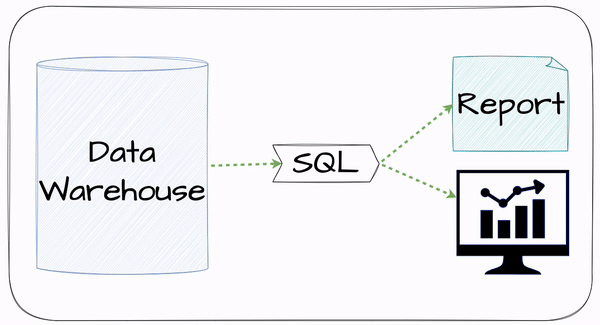

## Giới thiệu
Chào mọi người, trong những buổi livestream [trên kênh Tiktok của Tuân](https://www.tiktok.com/@tuan.data), Tuân thấy các bạn hay hỏi về `Cách học Data Engineering?` hoặc `Muốn làm Data Engineer thì cần học những gì?`.

Nên trong bài viết này Tuân sẽ chia sẻ đến mọi người về `Lộ trình học Data Engineering trong năm 2024`, lộ trình này được Tuân lấy ra từ khoá học `Mastering Data Engineering 2024` mà Tuân đang training cho những học viên của Tuân.

Thứ tự các phần bên dưới đã được Tuân sắp xếp theo thứ tự ưu tiên, cũng như là từ dễ đến khó. Vậy nên các bạn có thể bám sát vào học theo thứ tự này nhé!

Tuân hi vọng bài viết này sẽ hữu ích đến các bạn. Nếu các bạn có bất kỳ câu hỏi hoặc thắc mắc liên quan đến bài viết hoặc chủ đề về `Data Engineering`, hãy gửi mail cho Tuân tại địa chỉ mail [contact.tuandata@gmail.com](mailto:contact.tuandata@gmail.com) hoặc gửi tin nhắn đến [Facebook của Tuân](https://www.facebook.com/edgarle611/) nhé!

Và bây giờ mình cùng nhau bắt đầu nào.

## 1. What is Data Engineering?
Đầu tiên và cũng là quan trọng nhất khi các bạn tìm hiểu về Data Engineering hay nghề Data Engineer chính là hiểu về nghề, tìm hiểu về công việc của vị trí này là làm gì? Sự quan trọng của một Data Engineer trong một tổ chức? cũng như giá trị cốt lõi mà Data Engineer mang đến cho tổ chức.

## 2. SQL

First of all, it is SQL.

SQL is a crucial skill for Data Engineers because the first task of every Data Engineer is to adhoc report.
To retrieve requested adhoc reports effectively, Data Engineers need to have a solid understanding of both basic and advanced SQL concepts.

Understanding basic SQL help Data Engineers can adhoc reports as required. However, to save costs and efficiently adhoc report, Data Engineers need to have a deep understanding of advanced SQL techniques then optimize their query adhoc.

## 3. Python

The second is Python.

Python is the primary language for Data Engineers, so it is essential to master and understand it throughly.

Data Engineers use Python to write data processing pipelines to integrate data from various sources into Data Warehouse or Data Lake, in addition to transform data in ETL processes.

## 4. Git

The third is git.

## 5. Linux Command Line

## 6. Database Management System

## 7. Data Warehouse Concept

## 8. Big Data Framework

## 9. NoSQL Database

## 10. Cloud Services

## 11. DataOps

## 12. Data Visualization

## 13. Scalar

## Conclusion
I hope this explanation was clear and easy to understand for you to follow through the process.

