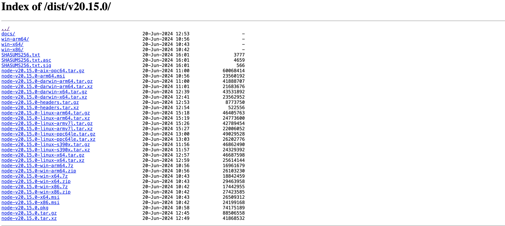

## Introduction
Hello everyone, today I would like to share about "How to install Node.js v20.15.0 on Raspberry Pi". I hope my following guide will be helpful to everyone.

To install Node.js on Ubuntu is relatively straightforward, but installing it on a Raspberry Pi, especially the latest version like v18.15.0, is not as simple. Today, I will guide you through the steps to install the latest version of Node.js on a Raspberry Pi. Let's begin with the following steps.

## Step by step
### Step 1: Download the Nodejs installation file
First of all, you should access the Node.Js download link at here: [Node.Js download](https://nodejs.org/dist/v20.15.0/).

Here, you should choose the installation file that matches your Raspberry Pi's architecture. I am using a **Raspberry Pi 4**, so I will download the **linux-arm64** version: `node-v20.15.0-linux-arm64.tar.gz`.

Right-click on the installation file you selected and choose "Copy Link Address" to copy the download link.

After you have the download link, go to your Raspberry Pi server and type the following command to download the installation file:
```bash title="tuandata@pi"
wget https://nodejs.org/dist/v20.15.0/node-v20.15.0-linux-arm64.tar.gz
```
### Step 2: Install NodeJs
After successfully downloading the installation file, run the following command to extract the file into a folder.
```bash title="tuandata@pi"
tar -xvf node-v20.15.0-linux-arm64.tar.gz
```
After successfully extracting the installation file into a folder, run the following command to copy necessary folder to the `/usr/` directory.
```bash title="tuandata@pi
sudo cp -r node-v20.15.0-linux-arm64/{bin,include,lib,share} /usr/
```
After successfully running the above command, check with the following command. If the output is as shown below, you have succeeded.
```bash title="tuandata@pi"
find /usr -name node
```
```
# result as the following
/usr/bin/node
/usr/include/node
/usr/share/doc/node
```
And finaly, we check version by running the following command.
```bash title="tuandata@pi"
node --version
```
## Conclusion
I hope this explanation was clear and easy to understand for you to follow through the process.