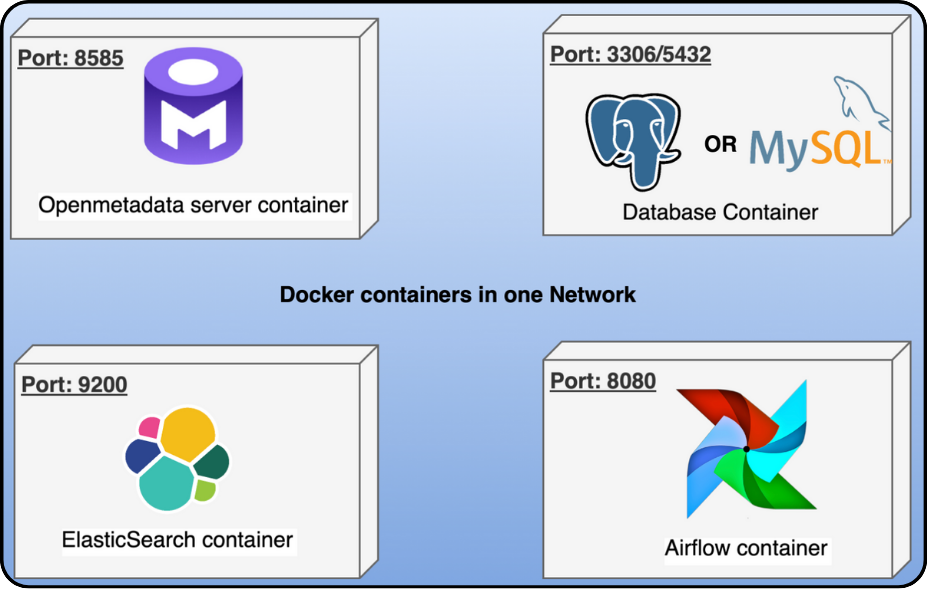

Trong bài trước Tuân đã chia sẻ đến các bạn các nội dung liên quan __Data Catalog__, 
nếu bạn nào chưa xem thì có thể xem tại đây nhé [__Data Catalog – Các công cụ quản lý thông tin dữ liệu__](https://tuandata.com/blog/data-catalog-la-gi/). Trong bài này, chúng ta sẽ cùng nhau tìm hiểu kỹ hơn về OpenMetadata qua các nội dung sau đây.

## Giới thiệu OpenMetadata

OpenMetadata là một nền tảng quản lý metadata Open Source, được phát triển dựa trên nền tảng quản lý metadata của Uber (Databook)
và ra mắt vào cuối năm 2021.

Giúp cho các member mới của team Data dễ dàng nắm bắt hệ thống Data Platform của team, giúp việc traceback các thông tin liên quan đến dữ liệu trở nên đơn giản hơn và nhanh hơn, mang lại cái nhìn tổng quan về hệ thống Data Platformm.

Và đáng chú ý hơn là người dùng chỉ cần connect OpenMetadata đến các công cụ sử dụng trong Data Platform lần đầu tiên để lấy metadata liên quan, sau đó nền tảng này sẽ tự động update metadata cho chúng ta, giúp chúng ta không phải lo bị outdate.

OpenMetadata hỗ trợ đa dạng connection đến các công cụ liên quan đến Big Data, các bạn có thể tham khảo tại đây: [__Các connector OpenMetadata hỗ trợ__](https://docs.open-metadata.org/latest/connectors).

## Kiến trúc

Kiến trúc của nền tảng OpenMetadata sẽ gồm 4 phần chính như sau:
- __OpenMetadata Server__: Phục vụ cho việc tương tác với người dùng trên nền tảng (bao gồm cả Frontend và Backend).
- __Database__: Lưu trữ thông tin metadata và các dữ liệu phục vụ cho việc hoạt động của nền tảng.
- __Ingestion framework__: Phục vụ cho việc tự động update metadata từ các nguồn (các công cụ trong Data Platform). 
- __Search index__: Giúp người dùng có thể sử dụng nền tảng OpenMetadata để search nhanh hơn.

## Hoạt động

Hoạt động thu thập và quản lý metadata của nền tảng OpenMetadata được thực hiện qua các bước như sau:
- 1. Đầu tiên người dùng chọn source cần thu thập metadata bằng cách tương tác trên UI của __OpenMetadata Server__(các connecter extractor).
- 2. __OpenMetadata Server__ sẽ tạo một workflow cho __Ingestion framework__. Workflow này sẽ thu thập dữ liệu metadata và tiến hành xử lý cho phù hợp với chuẩn dữ liệu của nền tảng, sau đó push đến API __OpenMetadata Server__ để thực hiện việc lưu trữ metadata. Và đương nhiên Workflow này được schedule để có thể tự động chạy.
- 3. __OpenMetadata Server__ sẽ tiến hành lưu trữ metadata xuống __Database__ và __Search Index__

## Phần kết

Chúng ta đã cùng nhau khám phá những khía cạnh quan trọng của OpenMetadata, từ giới thiệu tổng quan, kiến trúc chi tiết đến quy trình hoạt động của nền tảng này. Hy vọng rằng, qua bài viết này, bạn đã có cái nhìn rõ ràng hơn về OpenMetadata và cách nó có thể giúp bạn quản lý metadata hiệu quả hơn trong hệ thống Data Platform của mình.

Trong các bài viết tiếp theo, Tuân sẽ tiếp tục chia sẻ những kiến thức và kinh nghiệm thực tiễn về OpenMetadata, bao gồm hướng dẫn cài đặt, cấu hình và sử dụng các tính năng nâng cao. Hãy cùng đón chờ nhé!

### Tài liệu tham khảo

- https://atlan.com/openmetadata-explained/#:~:text=OpenMetadata%20is%20an%20open,Metadata%20Management%20%E2%80%93%20Start%20Tour