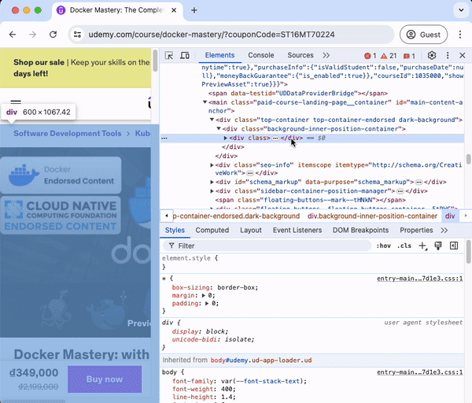
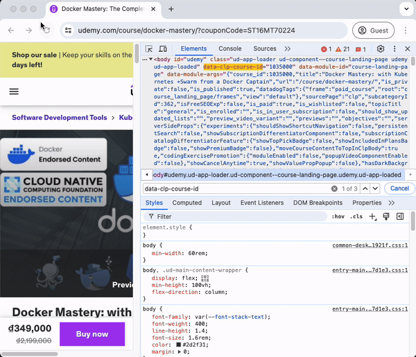

## Giới thiệu
Thông thường, mỗi khi Tuân tìm hiểu một kiến thức mới hoặc một vấn đề mới, bước đầu tiên của Tuân luôn là tìm cách để hiểu khái quát về nó, hiểu sơ về nó trước đã, trước khi mà đào sâu vào nó, để xem liệu nó có phù hợp với mục đích của Tuân không cũng như có cái nhìn toàn cảnh về nó.

Các nguồn mà Tuân hay đi xem là Document, Sách, các bài viết chia sẻ và các khoá học online trên Udemy và Coursera.

Trên nền tảng Udemy thì luôn hiển thị ngày cập nhật gần nhất của khoá học, nhưng Tuân vẫn muốn xem khoá học này đã lâu chưa? để chọn khoá học được tạo gần đây nhất. Vì khi được tạo gần đây nhất thì các thông tin trong khoá học cũng sẽ mới hơn gần với bây giờ hơn. Nhưng mà thông tin này không được hiển thị.

Vậy nên nếu bạn có cùng thắc mắc như Tuân, thì trong bài này Tuân sẽ chia sẻ đến mọi người cách mà Tuân đã kiểm tra được thời gian khoá học được tạo trên Udemy. Chúng ta cùng bắt đầu nhé.

## Hướng dẫn
### Bước 1
Các bạn vào trang khoá học các bạn muốn kiểm tra, sau đó click chuột phải chọn "Inspect" để mở ra mục DevTools nhé.

### Bước 2
Tại giao diện phần DevTools, các bạn gõ "Command F" (với máy Windows các bạn gõ "Ctrol F" nhé) để tiền hành search từ khoá này "*data-clp-course-id*".

Sau đó copy lại phần giá trị sau dấu "*=*".

### Bước 3
Bạn thay giá trị vừa copy được ở **Bước 2** vào phần *xxxx* của link này: https://www.udemy.com/api-2.0/courses/xxxx/?fields[course]=created

Rồi dán link trên vào trình duyệt, kết quả ngày tạo khoá học sẽ hiển thị ra cho bạn.

## Kết
Tuân hi vọng bài hướng dẫn ngắn trên thật sự hữu ích với mọi người.